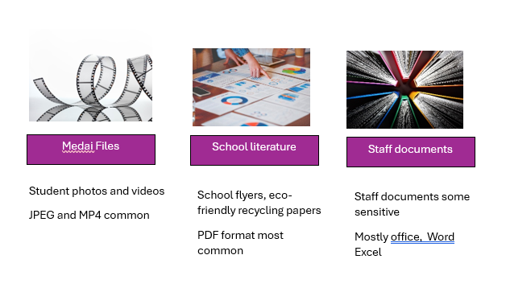

---
casestudy:
    title: 'Design a non-relational storage solution'
    module: 'Non-relational storage solutions'
---
# Design Non-relational Storage Case Study

## Requirements

Local Authority wants to reduce storage costs by reducing duplicate content and, whenever applicable, migrating it to the cloud. They would like a solution that centralizes maintenance while still providing access for students and family who browse media files and school literature. Additionally, they would like to address the storage of staff data files.

 

* **Media files**. Media files include product photos and feature videos that are displayed on the school’s public website, which is developed and maintained in house. When a student or family member browses to an item, the corresponding media files are displayed. The media files are in different formats, but JPEG and MP4 are the most common. 

* **School literature**. The school literature includes student success stories, current school projects and eco-friendly recycling information. Internal school users access the literature via a mapped drive on their Windows workstations. Students and family access the literature directly from the school’s public website.

* **Staff documents**. These are internal documents for departments such as art department and science department. These documents are accessed and managed via an internally developed web application. Legal requires that various documents be retained for a specific period of time. Occasionally documents will need to be maintained longer when legal or HR issues are being investigated. Most corporate documents older than one year are only kept for compliance reasons and are seldom accessed.

* **File location**. All the files are stored locally in the main school data center. There are numerous file shares organized by department. The data servers are struggling to provide files for the website. During peak hours website pages are slow to render. 

* **File access frequency**. Some are more popular, and that data is accessed more frequently. However, some services, like school trips, are only accessed during the summer season.  

## Tasks

1. Design a storage solution for loacl authority schools. 

      * What type of data is represented? 

      * What factors will you consider in your design?

      * Will you use blob access tiers?

      * Will you use immutable storage?

      * How will the content be securely accessed?

2.  Your solution should consider the media, marketing literature, and corporate documents. Your recommendations may be different depending on the data. Be prepared to discuss your decisions. 
