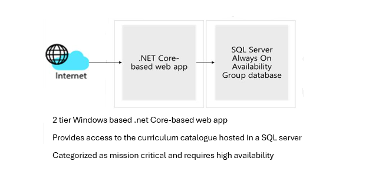

---
casestudy:
    title: 'Design a relational storage solution'
    module: 'Relational storage solutions'
---
# Design Relational Storage Case Study

## Requirements

The local authoring is looking to move their existing school public website database into Azure, as the website front end is being moved there as well.  The website front end will initially only be deployed in 2 regions for redundancy.  The database, which you are being asked to migrate, holds the curriculum catalogue, and all online reports.  Currently the database runs on a single Microsoft SQL Server Always On availability group on premises.

Primary concerns of local authority:

-	**High availability.**  A primary concern for the local authority is that this database be highly available as it is critical to their business.  Any outages may result in lost confidence.

-	**Website performance.**  While the performance of search for subjects matter is normally satisfactory, browsing or searching pages with many items listed is reported as being “sluggish.”

-	**Security.**  The local authority is very concerned about personal information stored in the database being exposed.  In addition to implementing proper security measures, the security team needs to verify that industry standard best practices are implemented, when possible.

## Tasks

1.	Design the database solution. Your design should include authorization, authentication, pricing, performance, and high availability. 
2.	Diagram what you decide and explain your solution.
